**Write Up Maquina Amor de DockerLabs**

Descargamos la máquina y descomprimimos con el comando **Unzip** desplegamos máquina con **sudo bash auto_deploy.sh amor.tar**

Una vez que compruebo que he hecho ping a la IP de la máquina 172.17.0.2 inicio un mapeo con Nmap y el comando **nmap 172.17.0.2 -p- -sV** para conocer los puertos que tiene abiertos y las versiones que utiliza.

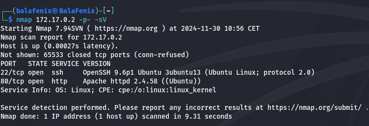

Meto la IP en la URL y encuentro lo siguiente:

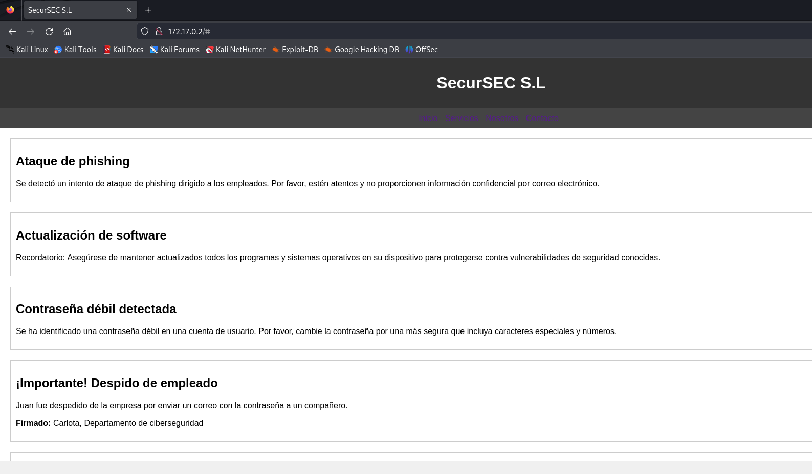

En esta página aparecen dos nombres Juan, que ya no pertenece a la organización, y Carlota que pertenece al departamento de ciberseguridad (aunque no lo parezca por la clave que tiene...)
Saco la password de Carlota mediante hydra y el diccionario RockYou.

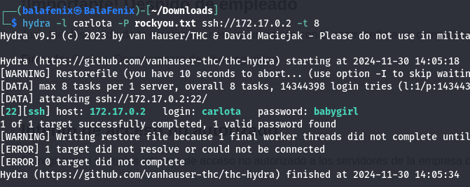

Establezco conexión ssh y en el escritorio de carlota encuentro una imagen dentro de la carpeta vacaciones, la descargo mediante **scp**

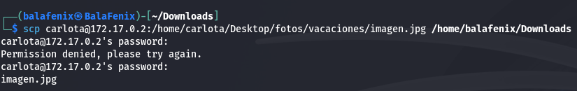

Y pruebo con la herramienta exiftool para ver si encuentro algo interesante en los metadatos.

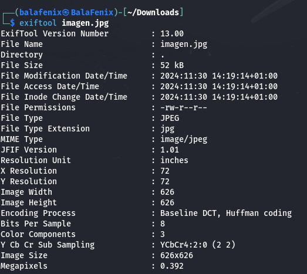

Utilizo la herramienta de esteganografía **stegseek** para ver lo que puede haber encapsulado en la imagen

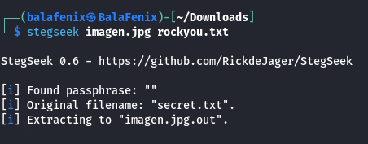

Descubro el archivo secret.txt y lo que hay en el

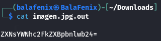

Verifico con Hash-Identifier que se trata de un archivo que está en base64

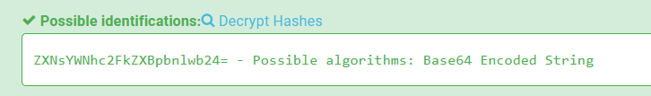

Descodifico y encuentro lo siguiente

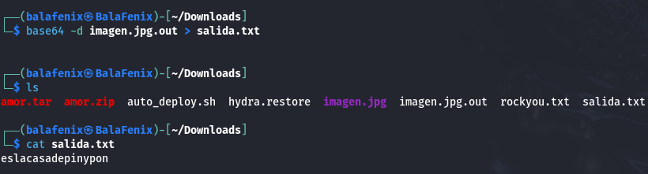

miro en /etc/passwd y encuentro un usuario que se llama oscar, utilizo el comando **su oscar** para cambiar de carlota a el y la clave que hemos sacado del hash anterior. Utilizo el comando **sudo -l** para ver como puedo elevar privilegios. Descubro que puedo hacerlo a través del binario Ruby.

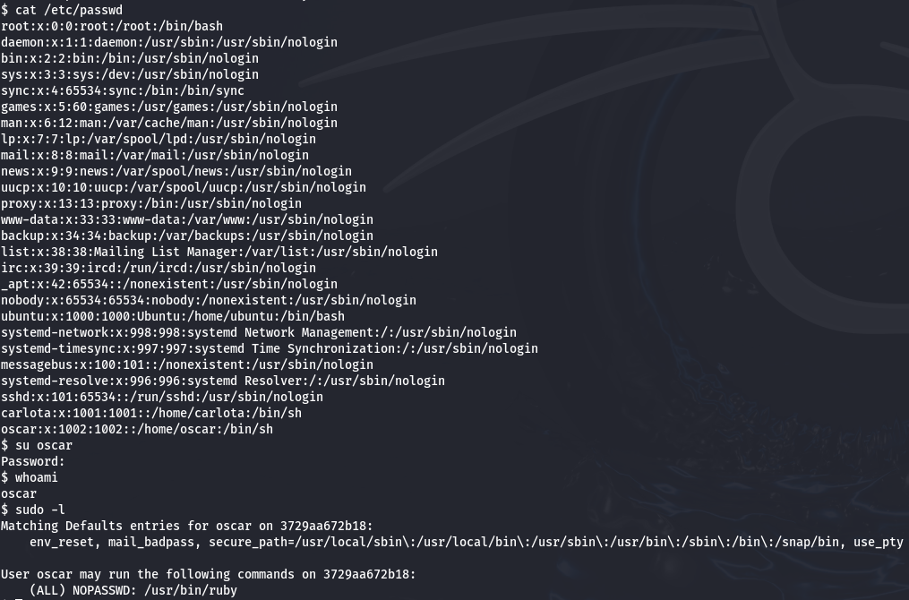

Consulto en https://gtfobins.github.io/gtfobins/ruby/ como puedo elevar privilegios e introduzco el comando **sudo ruby -e 'exec "/bin/sh"'**

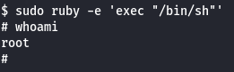

¡Ya somos root!
