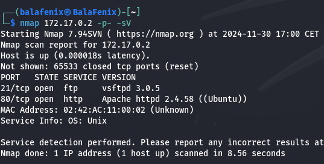

<h1>Write Up de la Máquina Anonymous Pingu de DockerLabs</h1>

Descomprimo el archivo zip con el comando **unzip** y despliego la máquina con el comando **sudo bash auto_deploy.sh anonymouspingu.tar**. Compruebo que hago ping a la IP de la máquina e inicio el escaneo con nmap y el comando **nmap 172.17.0.2 -p- -sV**

