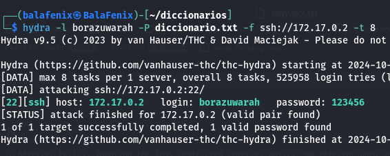

Como siempre para desplegar la máquina descomprimimos el archivo y lo ejecutamos con bash

Comprobamos que hacemos ping

Realizamos escaner de puertos abiertos y del sistema operativo que tiene la máquina. Introducimos IP en la URL del buscador y nos encontramos la siguiente imagen.
Inspecciono el código pero no encuentro más que la imagen así que voy a probar con Gobuster a ver si
encuentro algún archivo más indexado a la página.

No encuentro nada así que paso a buscar en los metadatos de la imagen.

Para analizar los metadatos
de la imagen utilizo la herramienta exiftool, lo que encuentro en ellos
es que el usuario es borazuwarah.

Compruebo si se trata de un usuario con conexión SSH. Me descargo un diccionario para poder trabajar con Hydra.
Descubro la password del usuario con Hydra

Inicio conexión SSH

Meto comando ls -l para ver a qué archivos tengo acceso, al no tener a
ninguno meto el comando sudo -l para ver quien tiene permisos de
superusuario

Introduzco sudo /bin/bash para abrir una nueva Shell de bash con
privilegios sudo

¡Ya somos root!
