Descargamos la máquina de la plataforma DockerLabs, previamente debemos tener instalador dockers con el comando **_sudo_** **_apt_**
**_install_** **_Docker.io_**, descomprimimos los archivos y ejecutamos para desplegar la máquina.

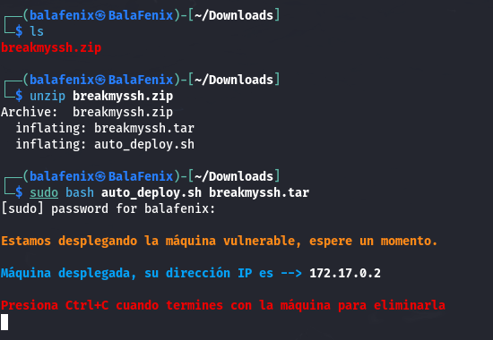

Vamos a realizar un escaneo de puertos con nmap

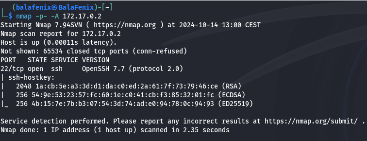

Veo que el único puerto abierto es el 22, el cual me permite establecer una conexión ssh, además la versión que utiliza tiene una vulnerabilidad de enumeración de usuarios conocido como CVE-2018-15473.

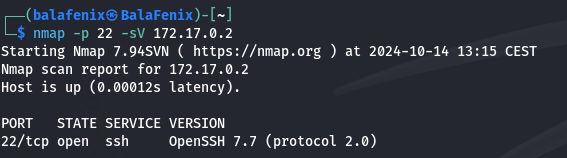

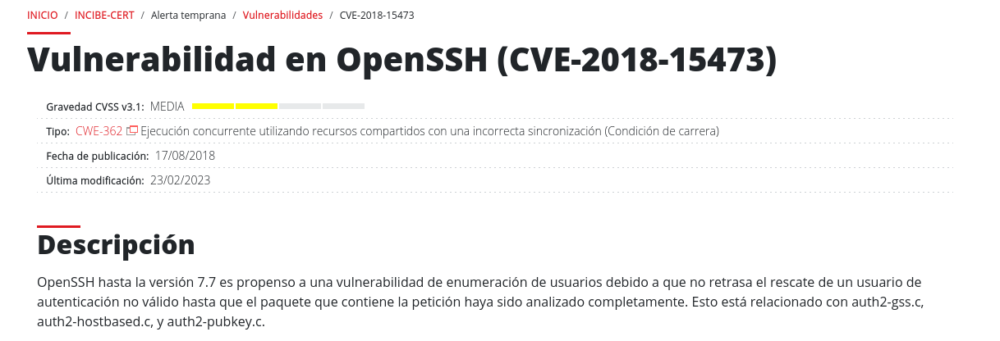

Voy a utilizar metaspliot y este CVE para intentar averiguar el nombre de algún usuario para ello sigo los siguientes pasos:

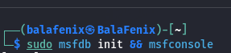

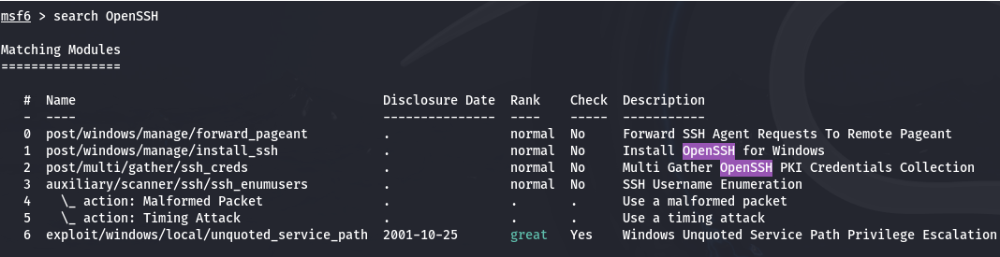

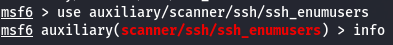

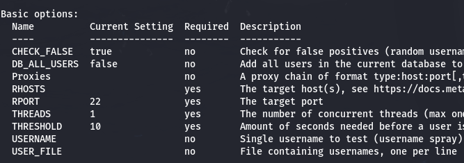

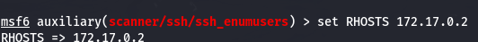

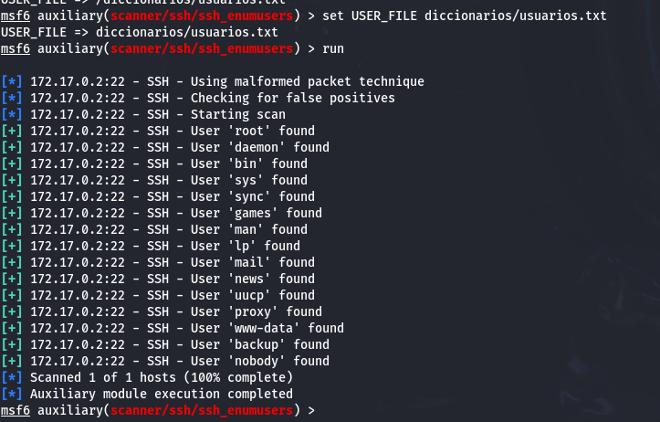

Una vez que he sacado el listado de usuarios de la máquina voy a hacer
fuerza bruta con hydra y un diccionario que previamente he descargado en
mi máquina.

La clave del usuario root es estrella
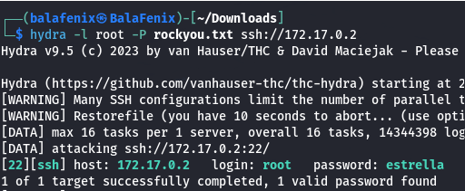

Establecemos la conexión ssh y accedemos a través de ella directamente a la máquina con privilegios
root.

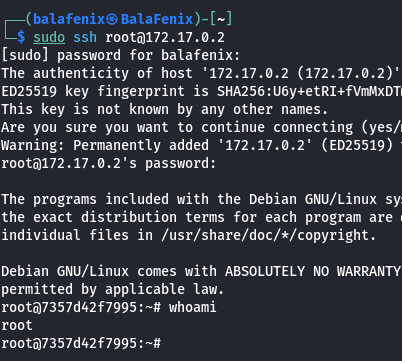

¡Estamos dentro!
