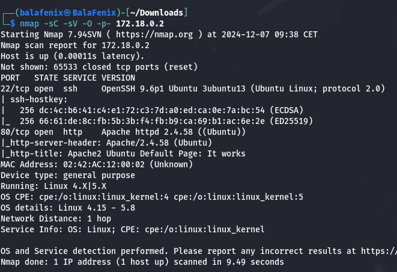
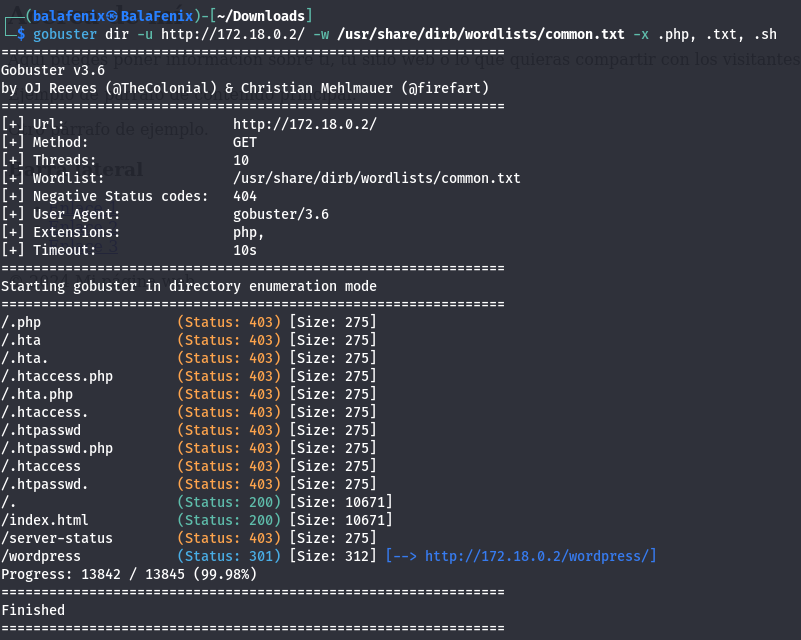
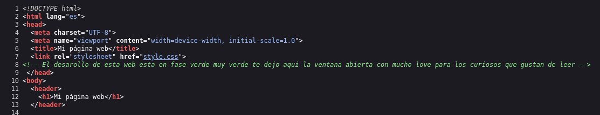

<h1>Máquina BuscaLove DockerLabs</h1>

Descargamos máquina, descomprimimos y desplegamos. Compruebo que hago ping e inicio el escaneo de puertos con nmap **nmap -sC -sV -O -p- 172.18.0.2**

Se trata de un sistema Linux con el puerto 22 y 80 abierto. Una vez que veo que en la página de inicio y en el código fuente de la IP no hay nada relevante utilizo gobuster con el siguiente comando
**gobuster dir -u http://172.18.0.2/ -w /usr/share/dirb/wordlists/common.txt -x .php, .txt, .sh**

Me lleva a una página de Wordpress,en su código fuente encuentro lo siguiente:

Compruebo que amor es un usuario de ssh con lo cual voy a utilizar hydra y el diccionario rockyou para sacar las credenciales
