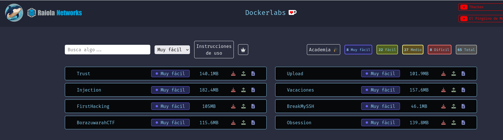
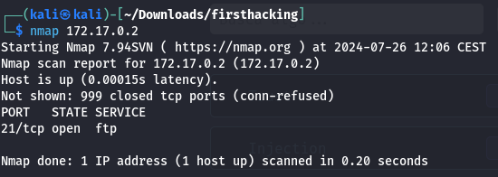
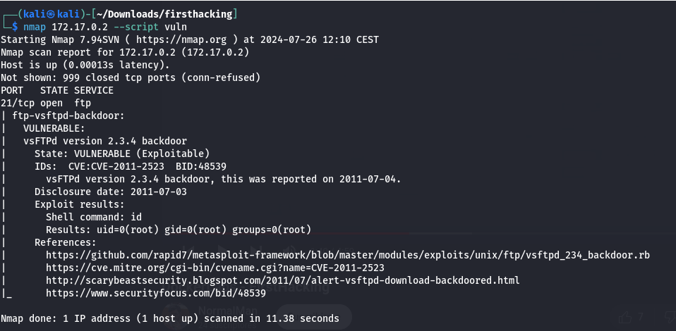
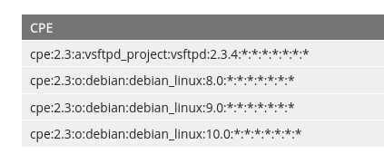
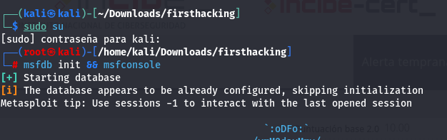
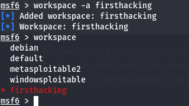
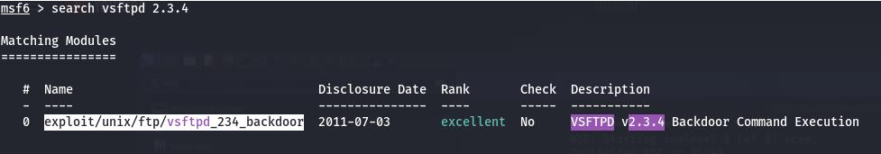
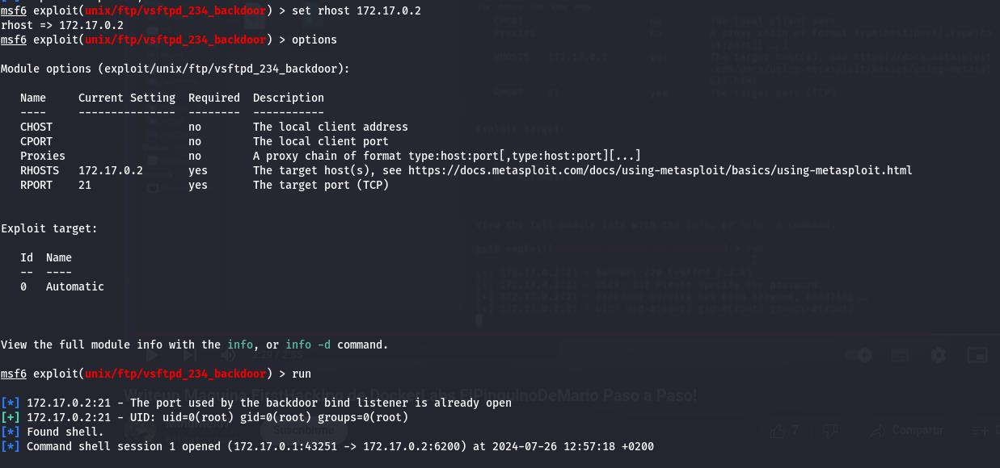
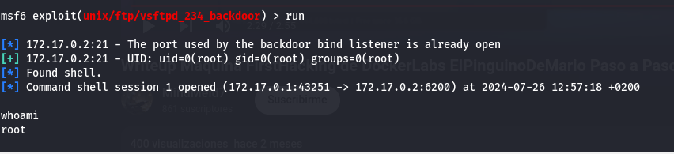

<h1> Write Up de la Máquina FirstHacking de Dockerlabs</h1>

Este es mi primer WriteUp. Voy a iniciar con la máquina llamada Firsthacking nivel muy fácil de la plataforma Dockerlabs.

Para iniciarla me meto en la plataforma y descargo el archivo. Descomprimo el archivo y lo ejecuto en Kali con el comando **sudo bash auto_deploy.sh firsthacking.tar**
para iniciar el script que da paso a la máquina.
Despliego máquina y lo primero que voy a hacer es
un escaneo de puertos con nmap para ver qué puertos tiene abiertos y como poder acceder por alguno de ellos.

Descubro que sólo tiene abierto el puerto 21. Le hago un **nmap 172.17.0.2 -–script vuln** para ver qué vulnerabilidades puedo explotar.

Encuentro la vulnerabilidad **CVE-2011-2523** y la información que consigo sobre ella en incibe es la siguiente:
Descripción: vsftpd versión 2.3.4 descargado entre 20110630 y 20110703,
contiene una puerta trasera (backdoor) que abre un shell en el puerto
6200/tcp. Tiene una puntuación de 9,80/10 lo que la convierte en
crítica/alta.

Afecta a las siguientes versiones:

Busco la vulnerabilidad y me indica que puedo explotarla en Metasploit

Inicio Metasploit, antes de buscar la vulnerabilidad creo un workspace
firtshacking.

Busco la vulnerabilidad en Metasploit

Selecciono el exploit y miro la información necesaria para explotarlo,
me solicita el RHOSTS el RPORT no es necesario ya que ya viene
configurado por el exploit.

¡Ya somos root!
