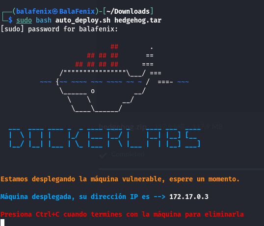
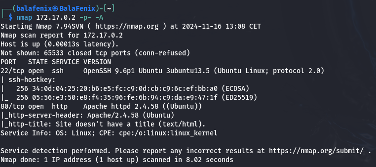

# Máquina HedgeHog Dockerlabs

Descomprimimos archivo con **unzip hedgehog.zip** y desplegamos la máquina como en las ocasiones anteriores

Tenemos el puerto 22 del servicio SSH corriendo y el puerto 80 que pertenece a http y las versiones correspondientes al equipo

Introduzco la IP en la URL y encuentro la palabra tails, pruebo a introducirla en hydra con el comando **hydra -l tails -p rockyou.txt ssh://172.17.0.2**

Descubro la clave del usuario y accedo mediante SSH.
