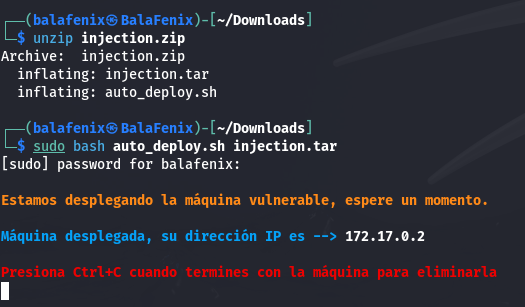
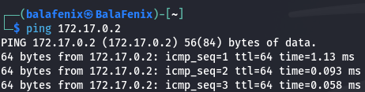
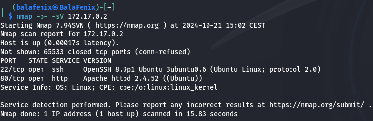
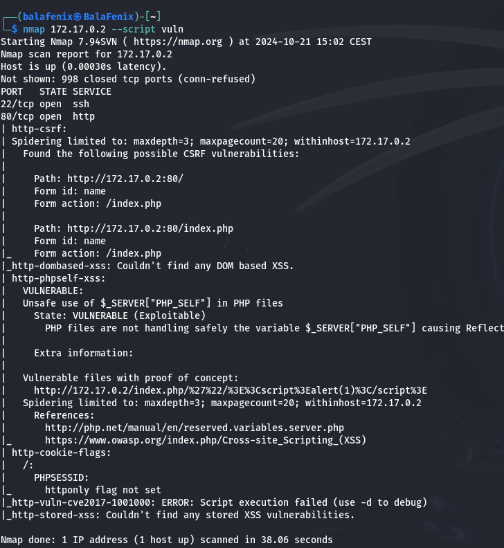
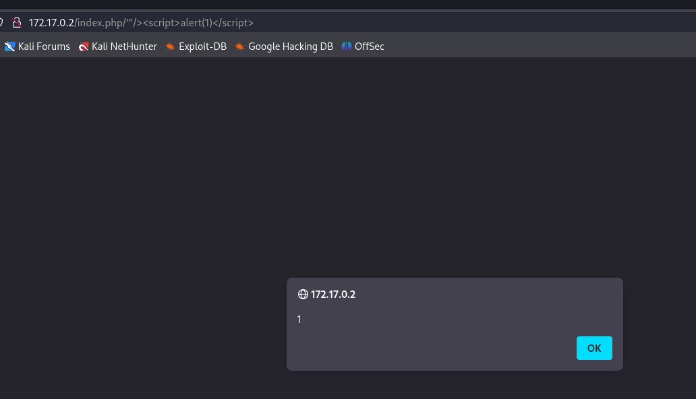
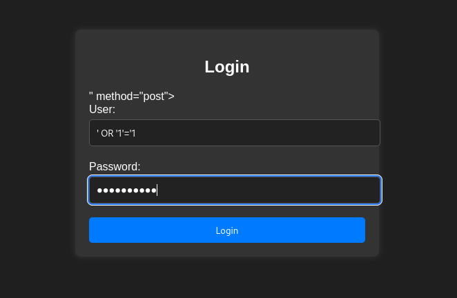
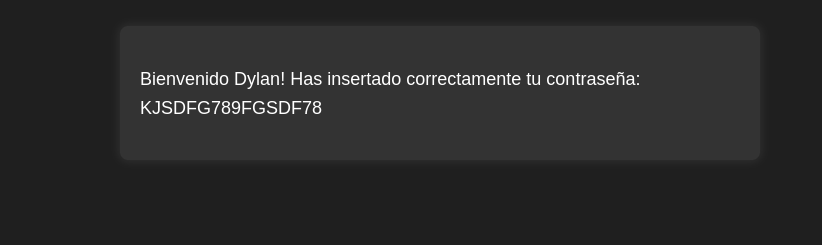
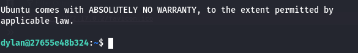
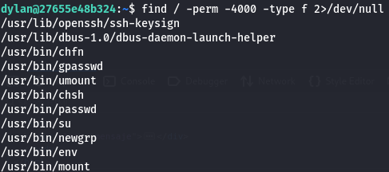
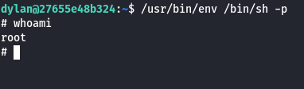

<!DOCTYPE MD>

## Máquina Injection Dockerlabs.

Descomprimimos archivo y desplegamos la máquina

Compruebo que hago ping con la máquina a la que voy a atacar

Voy a realizar un escaneo de puertos y versiones a través de Nmap

Busco vulnerabilidades con Nmap

Introduzco el script que me ha indicado Nmap que es vulnerable en la URL del navegador e inyecto código

Una vez que tengo el usuario y la clave voy a establecer una conexión SSH!

Una vez que la tengo voy a ver si hay archivos mal configurados con el comando **find / -perm -4000 -type f 2>/dev/null** y voy a intentar ejecutar un shell de alguno de ellos

pruebo a hacer la escalada de privilegios con todos los archivos hasta que puedo acceder con /usr/bin/env /bin/sh -p que lo utilizamos para decirle al archivo que no elimine los privilegios del SUID.

¡Ya somos root!
