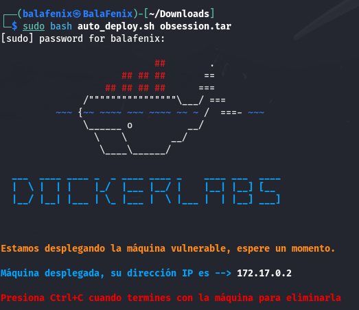
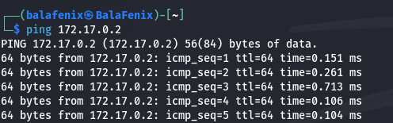
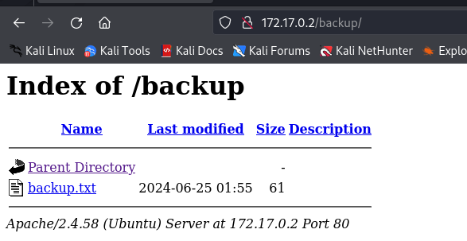
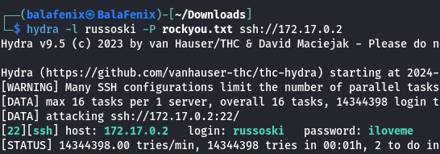
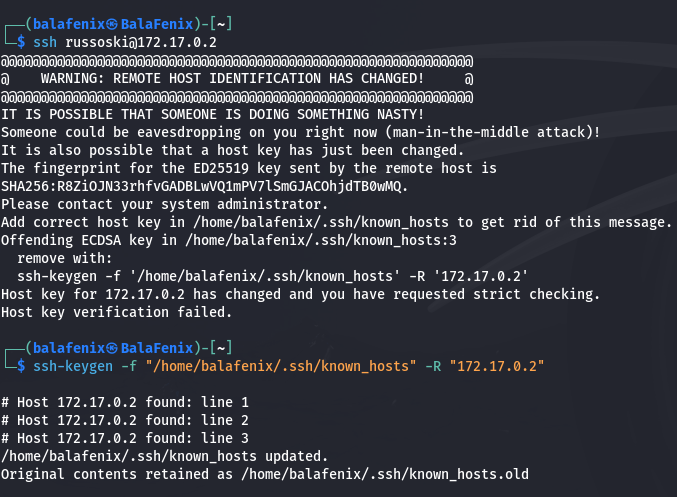
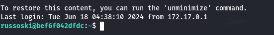
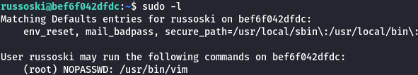
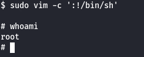

<!DOCTYPE md>

## Writte Up Máquina Obsession DockerLabs.

Para desplegar nuestra máquina que previamente hemos descargado de la plataforma DokerLabs tenemos que descomprimir el archivo con **unzip obsession.zip** Lo ejecutamos y desplegamos la máquina

Compruebo que tengo conexión con la máquina haciendo ping

Realizo escaneo de puertos y versiones con Nmap

Busco alguna vulnerabilidad con nmap --script vuln

Introduzco la IP de la máquina /backup como se me indicaba en el escaneo anterior y encuentro un archivo .txt

Trabajo con hydra y el diccionario rockyou.txt para sacar la password del usuario russoski

Intento iniciar conexión SSH pero me aparece el siguiente mensaje, así que cambio la clave del servidor para conseguir el acceso por SSH

Utilizo el comando sudo -l para ver qué tiene usuarios root y como puedo escalar privilegios

Veo que puedo hacerlo a través de Vim y consulto en https://gtfobins.github.io/ introduzco el comando **sudo vim -c ':!/bin/sh'** y...!ya somos root!

