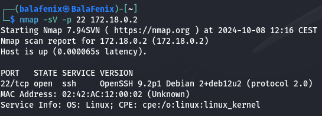

<h1> Write Up Máquina Trust DockerLabs</h1>

Write up paso a paso de la máquina Trust de la plataforma Dockerlabs.
[<u>https://dockerlabs.es/</u>](https://dockerlabs.es/)
Descargo la máquina y antes de iniciarla tengo que tener instalado Docker, lo hago
con el comando **sudo apt install docker. io**

Descomprimimos el archivo con el comando **unzip**

Desplegamos la máquina e iniciamos el escaneo de puertos con nmap utilizo el comando **nmap -p- -A** 172.18.0.2 para que me realizara un escaneo completo de todos los puertos y detectara las versiones de servicios y los sistemas operativos.

Por lo que observamos en la captura hemos podido detectar que el puerto
22 que pertenece al servicio SSH está abierto y corriendo y además hemos
encontrado dos claves de host SSH.También se observa que esta abierto y
corriendo el puerto 80 que pertenece al servicio HTTP con el servidor
Apache. Del sistema operativo podemos saber que se trata de un Linux.

Introduzco en la URLdel buscador la IP de la máquina a la que estamos
atacando y nos aparece la página principal deApache, no encuentro nada
relevante en ella ni en su código fuente.

Voy a utilizar la herramienta Gobuster para hacer Fuzzing, que es una
forma de analizar si hay algún archivo que no está visible a simple
vista. Gobuster es un diccionario que encuentra estos términos. Añadimos
las extensiones después del comando -x con las que más usualmente se
suelen programar páginas y encontramos tres con el status 200 lo cual
nos indica que la página está Ok y podremos acceder a ella.

Probamos las tres y en /secret.php encontramos esto:

Analizo el código fuente y no encuentro nada más así que voy a intentar
hacer fuerza bruta en el puerto 22 que pertenece al servicio SSH con la
herramienta Hydra y el usuario Mario. (Previamente analicé con nmap el
puerto 22 y la versión de SSH para ver si había algún CVE o
vulnerabilidad encontrada en esta versión)

Antes de usar Hydra con mkdir
cree la carpeta wordlist dentro de Documents y descargué de git hub el
diccionario rockyou2024.txt

Una vez que conseguimos con Hydra sacar la password: **_Chocolate_** del usuario Mario introducimos el comando para acceder mediante conexión ssh y la password para poder acceder al equipo.

Para escalar privilegios tenemos que usar Vim con el comando -c
‘:!/bin/bash’ ya cuando ejecutas este comando, Vim abre una sesión con
privilegios de root y, usando :!, ejecuta un shell interactivo de Bash.
Debido a que estás ejecutando Vim con sudo, el shell Bash también se
ejecuta como root, lo cual nos otorga esos privilegios.

¡Ya somos root!
