<h1>Máquina Vacaciones de la plataforma
DockerLabs </h1>

Una vez hemos descargado la máquina en .zip la descomprimimos con el comando **unzip**
Para desplegarla y poder trabajar con ella tendrás que tener instalado
Docker lo cual lo puedes hacer utilizando el comando: **sudo apt install Docker.io**
Una vez que tenemos Docker instalado desplegamos la máquina.

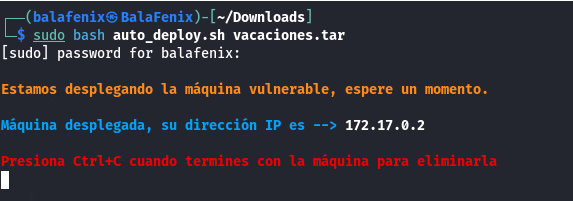

Una vez desplegada podemos empezar a trabajar con ella, lo primero es comprobar si hago ping a la dirección IP de la máquina.

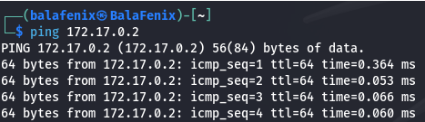

Después de asegurarnos que tenemos conexión con la máquina vamos a realizar un escaneo de puertos con nmap. He utilizado el comando **nmap -p- -A 172.17.0.2** para que me realizara un escaneo completo de todos los
puertos, detectara las versiones de servicios y los sistemas operativos.
Por lo que observamos en la captura hemos podido detectar que el puerto 22 que pertenece al servicio SSH está abierto y corriendo.También se observa que esta abierto y corriendo el puerto 80 que pertenece al servicio HTTP con el servidor Apache. Del sistema operativo podemos saber que se trata de un Linux.

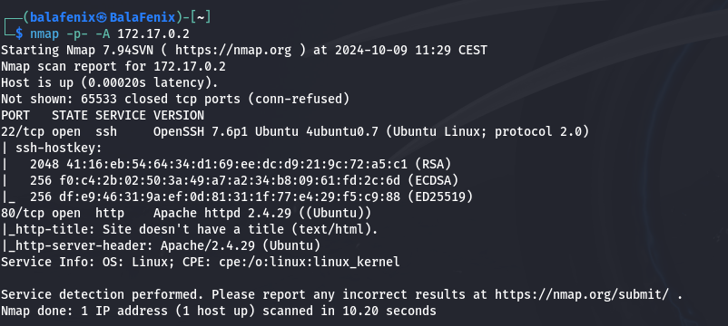

Cuando metemos la IP de la máquina en el la URL del buscador la página aparece en blanco pero si analizamos el código fuente de esta nos encontramos lo siguiente:

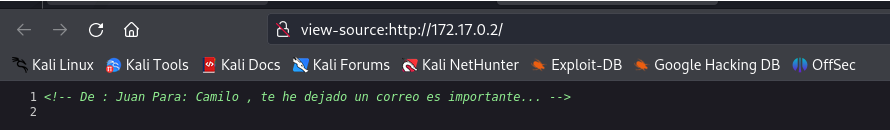

Lo cual nos puede indicar que es un nombre de usuario y que podríamos
hacer fuerza bruta en el puerto 22 con el servicio SSH.Antes de esto voy a buscar si hay alguna vulnerabilidad conocida en la versión de OpenSSH que está corriendo en la máquina.

El CVE-2018-15473 indica que OpenSSH a 7.7 es propenso a una vulnerabilidad de enumeración de usuarios.

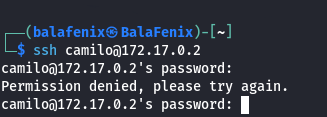

Camilo tiene acceso con SSH con lo cual vamos a utilizar la herramienta Hydra para intentar sacar la clave este usuario y poder acceder a la
máquina.

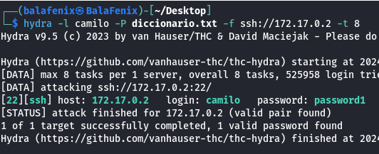

Ya tenemos la clave de camilo así que vamos a iniciar la conexión SSH

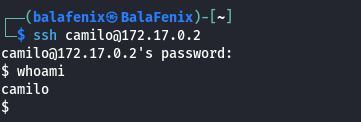

Una vez dentro vamos a
intentar escalar privilegios, pero por lo que nos indica Camilo no tiene privilegios de usuario sudo

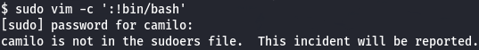

En el comentario que Juan dejó en el código fuente de la página a Camilo
ponía que le había mandado un mail así que lo buscamos en
/var/mail/camilo encontramos el archivo y lo abrimos.

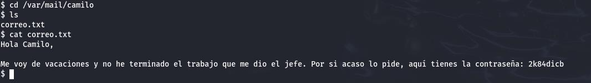

Establecemos la conexión ssh con el usuario juan y su contraseña
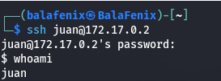
Juan tampoco tiene privilegios de usuario sudo así que con el comando -l
listamos a ver qué usuarios lo tienen, nos aparece /usr/bin/ruby

Vamos a la página [<u>GTFOBins</u>](https://gtfobins.github.io/) para
ver como elevar privilegios en este caso

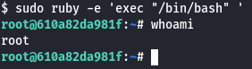

¡Ya somos root!
